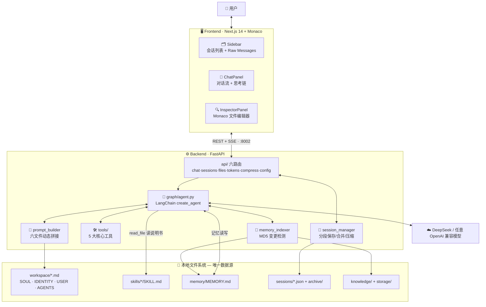

<div align="center">

# 🦞 mini OpenClaw

**一个把「记忆」与「技能」都还给文件的透明 AI Agent 工作台**

*File-first Memory · Skills as Plugins · Zero Black Box*

[](https://www.python.org/)
[](https://fastapi.tiangolo.com/)
[](https://github.com/langchain-ai/langchain)
[](https://www.llamaindex.ai/)
[](https://www.deepseek.com/)
[](https://nextjs.org/)
[](https://www.typescriptlang.org/)
[](./Mini-OpenClaw%20%E5%BC%80%E5%8F%91%E9%9C%80%E6%B1%82%E6%96%87%E6%A1%A3%20(PRD).pdf)

[快速开始](#-快速开始) · [架构总览](#-架构总览) · [核心机制](#-agent-是如何学习技能的) · [项目结构](#-项目结构)

</div>

---

> ### 💭 它不做平台，只做你的数字副手
> mini OpenClaw 复刻并优化 [OpenClaw](https://openclaw.ai)（原名 Moltbot/Clawdbot）的核心体验：没有数据库黑盒，没有不可见的提示词魔法 ——
> **你的每一次对话躺在 JSON 里，Agent 的每一次反思躺在 Markdown 里，打开就能看、就能改。**

---

## 🏛️ 三大设计支柱

| 🗂️ 文件即记忆 | 🧩 技能即插件 | 🔍 全程透明 |
|:---:|:---:|:---:|
| 记忆直接躺在 `memory/MEMORY.md`，会话躺在 `sessions/*.json`。摒弃数据库，回归人类可读的文件系统。 | 遵循 Anthropic Agent Skills 范式，一个文件夹 + 一份 `SKILL.md` 就是**一项能力**，拖入即用，零代码注册。 | System Prompt 六文件拼接、工具调用链、记忆读写全可见。前端 **Raw Messages 面板**实时审视 Agent 一举一动。 |

## ✨ 功能全景

- 💬 **流式对话** — SSE 七类事件（`token` / `tool_start` / `tool_end` / `new_response` / `retrieval` / `title` / `done`）逐条推送，思考链实时可视化
- 🧠 **记忆双模式** — `MEMORY.md` 全文注入 ⇄ RAG 向量检索**一键切换**；MD5 变更检测让索引只在内容变化时重建，省 API 费
- 🧩 **Instruction-following 技能** — Agent 靠 `read_file` 读 SKILL.md 说明书自学新能力，用核心工具组合执行
- 📜 **六文件 System Prompt** — SOUL / IDENTITY / USER / AGENTS / 技能快照 / 记忆动态拼接，**Monaco 在线改完立即生效，无需重启**
- 🗜️ **对话压缩** — 前 50% 历史 LLM 摘要归档至 `sessions/archive/`，`compressed_context` 累积拼接，长会话不爆 Token、记忆不丢
- 📊 **Token 记账** — tiktoken `cl100k_base` 会话级 + 文件级统计，侧边栏实时显示
- 🖥️ **IDE 三栏布局** — 会话列表 ｜ 对话流 ｜ Monaco 检查器，拖拽调宽，浅色 Apple 毛玻璃风格（克莱因蓝 × 活力橙）
- 🏷️ **AI 自动命名** — 首轮对话自动生成 ≤10 字标题，失败时降级用用户消息兜底

## 🏗️ 架构总览



**技术栈**：FastAPI · LangChain 1.x `create_agent`（LangGraph 运行时） · LlamaIndex · DeepSeek · tiktoken · Next.js 14 (App Router) · TypeScript · Tailwind CSS · Monaco Editor

## 🛠️ 五大核心工具

| 工具 | 名称 | 能力 | 安全边界 |
|---|---|---|---|
| 🖥️ 命令行 | `terminal` | 沙箱内执行 Shell 命令 | 高危指令黑名单 + `root_dir` 锁定 + 30s 超时 + 输出截断 |
| 🐍 Python 解释器 | `python_repl` | 逻辑计算、数据处理、脚本执行 | 独立 REPL 环境 |
| 🌐 网页获取 | `fetch_url` | 抓 URL 并清洗为 Markdown | 15s 超时，HTML→MD 省 Token，5000 字符截断 |
| 📄 文件读取 | `read_file` | 读项目内文件（技能机制核心依赖） | `resolve()` 后锁定项目根，严禁越界读取 |
| 🔎 知识库检索 | `search_knowledge_base` | `knowledge/` 目录语义检索 | 索引持久化于 `storage/`，复用免重建 |

## 🧬 Agent 是如何"学习"技能的？

这是本系统最独特的设计 —— **Skills 不是预写好的 Python 函数，而是教 Agent 使用基础工具的说明书**：

```
用户: "帮我查一下北京的天气"
        │
        ▼
① 感知 ── Agent 在 System Prompt 中看到 <available_skills> 技能快照
        │
        ▼
② 决策 ── 发现 get_weather 技能与请求匹配
        │
        ▼
③ 行动 ── 不调用任何 get_weather() 函数（它不存在！）
          而是调用 read_file("./backend/skills/get_weather/SKILL.md")
        │
        ▼
④ 执行 ── 读懂说明书后，动态组合 fetch_url / python_repl 等核心工具完成任务
```

每次启动时 `tools/skills_scanner.py` 扫描 `skills/` 下所有 `SKILL.md` 的 Frontmatter，生成 XML 风格技能快照注入 System Prompt。

## 📜 System Prompt 配方

每次对话前，六大 Markdown 文件按序动态拼接（单文件超 20k 字符自动截断）：

```
SKILLS_SNAPSHOT.md  →  能力列表（自动生成）
SOUL.md             →  核心设定与设计哲学
IDENTITY.md         →  自我认知
USER.md             →  用户画像
AGENTS.md           →  行为准则 + 技能调用协议 + 记忆协议
MEMORY.md           →  长期记忆（RAG 模式下不拼，改为按需检索注入）
```

想改变 Agent 的性格？编辑 `SOUL.md`。想让它记住你的偏好？编辑 `USER.md` 或 `MEMORY.md`。**一切皆文件**，且每轮请求都重读——**改完立即生效，无需重启**。

## 🗜️ 对话压缩与记忆闭环

```
sessions/*.json 消息过多
        │
        ▼
POST /compress → DeepSeek 把前 50% 压缩为 ≤500 字摘要
        │
        ▼
原始消息归档 sessions/archive/{id}_{ts}.json （可追溯）
主文件保留后半段 + compressed_context 累积摘要
        │
        ▼
下一次对话时摘要以 [以下是之前对话的摘要] 注入头部
```

## 🚀 快速开始

### 0️⃣ 环境要求

| 组件 | 版本 | 说明 |
|---|---|---|
| Python | 3.12.7 | 后端（强制 Type Hinting） |
| Node.js | 18+ | 前端 |
| DeepSeek API Key | — | 对话必需 |
| DASHSCOPE 兼容 Key | 可选 | 仅 RAG 模式需要（Embedding） |

### 1️⃣ 安装依赖

前后端依赖互相独立，**开两个终端分别执行**，都跑完再进行下一步。

**终端 A — 后端**（`requirements.txt` 在仓库根目录）：

```bash
# 在仓库根目录创建虚拟环境并安装依赖
py -3.12 -m venv .venv
.venv\Scripts\activate                # Windows；macOS/Linux: source .venv/bin/activate
python -m pip install -r requirements.txt
```

> ⚠️ **请用 `python -m pip` 而非裸 `pip`** —— 前者把 pip 绑定到当前解释器，即使 PATH 里存在多个 Python（Anaconda / 系统 / Store 版）也绝不会装错环境。裸 `pip` 依赖 `activate` 成功改了 PATH，一旦没生效就会**静默装进全局环境**，不报错。

**终端 B — 前端**：

```bash
cd frontend
npm install
```

> 💡 依赖只需装一次；后续重启直接跳到第 3、4 步。`npm install` 较慢时可以先启动后端。

### 2️⃣ 配置环境变量

在 `backend/` 下创建 `.env`（可从 `.env.example` 复制），**最少填一行**：

```bash
DEEPSEEK_API_KEY=sk-xxx
```

完整变量表见下方 [🔑 环境变量一览](#-环境变量一览backendenv)。

### 3️⃣ 启动后端（端口 8002）

```bash
cd backend
../.venv/Scripts/activate              # 激活第 1 步在根目录建的虚拟环境
uvicorn app:app --host 0.0.0.0 --port 8002 --reload
```

看到 `✅ mini OpenClaw backend ready` 即成功。

> 🔍 确认装对了地方：`python -c "import fastapi, langchain; print('✅ 依赖正常')"` —— 在**已激活**的终端里执行。报 `ModuleNotFoundError` 说明环境没对，别急着排查代码。

### 4️⃣ 启动前端（端口 3000）

```bash
cd frontend
npm run dev
```

打开 http://localhost:3000 即可使用。

### 5️⃣ 体验核心链路

1. 输入「查询北京天气」→ 观察思考链出现 `read_file`（读技能）→ `fetch_url` / `python_repl`（执行）；
2. 工具结束后**新气泡**开始打字机输出（`new_response` 分段机制）；
3. 首轮结束侧边栏自动出现 AI 生成的标题；
4. 点开侧边栏 **Raw Messages**，审视完整 System Prompt；
5. 右侧 Inspector 编辑 `memory/MEMORY.md`，Ctrl+S 保存，RAG 索引自动重建（后端日志 `🔄 Memory index rebuilt`）。

### 🔑 环境变量一览（`backend/.env`）

| 变量 | 必填 | 默认值 | 说明 |
|---|:---:|---|---|
| `DEEPSEEK_API_KEY` | ✅ | — | 对话模型密钥 |
| `DEEPSEEK_MODEL` | — | `deepseek-chat` | 模型名称 |
| `DEEPSEEK_BASE_URL` | — | `https://api.deepseek.com` | 可替换为任意 OpenAI 兼容网关 |
| `OPENAI_API_KEY` | RAG 模式 | — | Embedding 向量化密钥 |
| `OPENAI_BASE_URL` | — | `https://ai.devtool.tech/proxy/v1` | Embedding 服务地址 |
| `EMBEDDING_MODEL` | — | `text-embedding-3-small` | 向量模型 |
| `OPENWEATHER_API_KEY` | 天气技能 | — | `get_weather_open` 技能调用所需 |

> 💡 最低可用配置只需一个 `DEEPSEEK_API_KEY` —— RAG 检索、天气技能均可后置开启。

## 📁 项目结构

```
mini-openclaw/
├── backend/                    # FastAPI + LangChain Agent
│   ├── app.py                  # 入口（端口 8002，lifespan 三步初始化）
│   ├── config.py               # JSON 配置持久化（RAG 开关）
│   ├── api/                    # 六路由：chat · sessions · files · tokens · compress · config_api
│   ├── graph/                  # Agent 编排：agent · prompt_builder · session_manager · memory_indexer
│   ├── tools/                  # 5 大核心工具 + skills_scanner
│   ├── workspace/              # System Prompts（SOUL / IDENTITY / USER / AGENTS）
│   ├── skills/                 # Agent Skills 技能文件夹（SKILL.md 说明书）
│   ├── memory/                 # MEMORY.md 长期记忆
│   └── sessions/               # JSON 会话记录 + archive/ 压缩归档
│
└── frontend/                   # Next.js 14（App Router，IDE 三栏布局）
    └── src/
        ├── app/               # 根布局 + 三栏主页面
        ├── components/         # chat · editor · layout
        └── lib/               # api.ts（SSE 解析器）· store.tsx（全局状态）
```

<details>
<summary><b>🔌 API 一览</b>（点击展开）</summary>

| 方法 | 端点 | 功能 |
|---|---|---|
| `POST` | `/api/chat` | 核心对话（SSE 七类事件流式） |
| `GET` | `/api/files?path=` | 读取文件内容（目录白名单） |
| `POST` | `/api/files` | 保存文件（MEMORY.md 触发索引重建） |
| `GET` | `/api/skills` | 技能列表（frontmatter 解析） |
| `GET` | `/api/sessions` | 会话列表（mtime 倒序） |
| `POST` | `/api/sessions` | 创建会话 |
| `PUT` | `/api/sessions/{id}` | 重命名会话 |
| `DELETE` | `/api/sessions/{id}` | 删除会话 |
| `GET` | `/api/sessions/{id}/messages` | 原始消息（含完整 System Prompt） |
| `GET` | `/api/sessions/{id}/history` | 会话历史（含 tool_calls） |
| `POST` | `/api/sessions/{id}/generate-title` | AI 生成标题（带兜底降级） |
| `POST` | `/api/sessions/{id}/compress` | 压缩前 50% 历史为摘要 |
| `GET` | `/api/tokens/session/{id}` | 会话 Token 统计 |
| `POST` | `/api/tokens/files` | 文件列表 Token 统计 |
| `GET` | `/api/config/rag-mode` | 查询 RAG 模式 |
| `PUT` | `/api/config/rag-mode` | 切换 RAG 模式 |

</details>

<details>
<summary><b>➕ 编写你自己的技能</b>（点击展开）</summary>

在 `backend/skills/` 下新建文件夹，放入 `SKILL.md`：

```markdown
---
name: my_awesome_skill
description: 一句话说清触发场景 —— Agent 靠它判断何时匹配此技能
---

# 我的技能

## 使用场景
何时应该使用这个技能……

## 操作步骤
1. 使用 fetch_url 访问 xxx API
2. 使用 python_repl 处理返回数据
3. 按以下格式输出结果……

## 示例
（给 Agent 看的 few-shot 示例）
```

重启后端后 `SKILLS_SNAPSHOT.md` 自动更新。写说明书的诀窍：**你是在教一个聪明的实习生，而不是在写死板的代码** —— 把步骤、边界、示例讲清楚，Agent 会用核心工具灵活组合执行。

</details>

逐文件深度导读见 [ZHIDAO.md](ZHIDAO.md) 📖

## 🗺️ Roadmap

- [x] 核心对话 + SSE 七类事件流式输出
- [x] 六文件 System Prompt 拼接 + Monaco 在线编辑
- [x] Instruction-following 技能系统（扫描 / 快照 / read_file 学习）
- [x] 记忆双模式（全文注入 ⇄ RAG 向量检索，MD5 变更检测）
- [x] 对话压缩归档 + Token 统计 + AI 自动命名
- [ ] BM25 + 向量混合检索（对齐 PRD，当前为向量检索；实现时建议用纯 Python 的 `rank_bm25` 避开 pystemmer 编译问题）
- [ ] 同 session 并发写保护（文件锁 / 数据库迁移）
- [ ] 多模型路由（按任务自动切换模型）
- [ ] 记忆自动反思与整理调度

---

<div align="center">

**🤝 参与贡献** — Fork → Branch → PR，欢迎提交新技能与新工具！

需求见 [PRD](./Mini-OpenClaw%20%E5%BC%80%E5%8F%91%E9%9C%80%E6%B1%82%E6%96%87%E6%A1%A3%20(PRD).pdf) · 深度导读见 [ZHIDAO.md](ZHIDAO.md)

**mini OpenClaw** · 文件即记忆 · 技能即插件 · 全程透明

</div>
